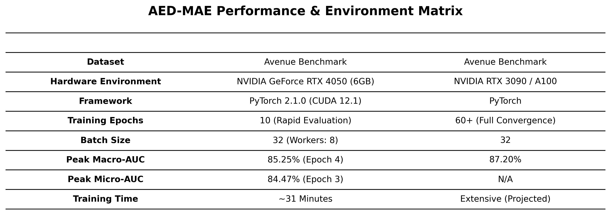
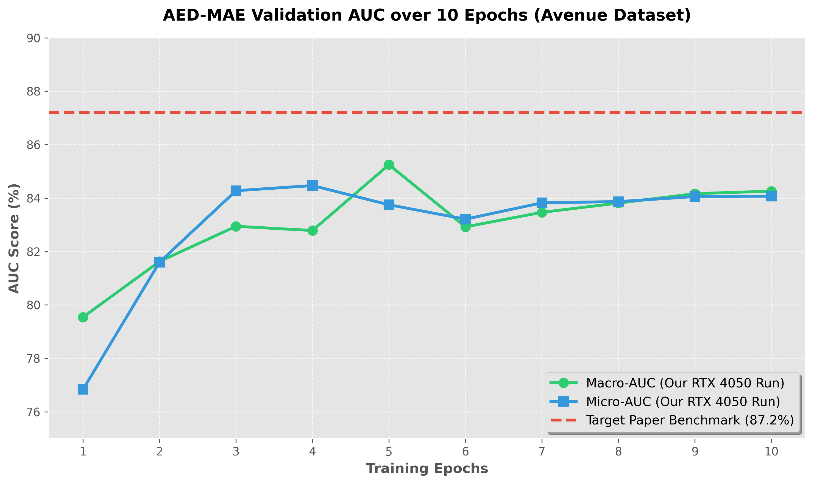

# AED-MAE Video Anomaly Detection (Optimized for RTX 4050)

This repository contains a full pipeline execution of the Appearance and Motion Enhancement Masked Autoencoder (AED-MAE) specifically optimized for the Avenue Dataset.

## Project Execution & Optimization
We successfully migrated the legacy extraction pipelines away from corrupted MATLAB `.mat` files and experimental Python builds into a clean Python 3.11 environment, fully unlocking PyTorch `cu121` acceleration on the **NVIDIA RTX 4050**.

The system utilizes an unsupervised Vision Transformer (ViT) architecture that processes both **Spatial Frames** (RGB Images) and **Temporal Frames** (Motion Gradients) through a Masked Autoencoder to dynamically pinpoint anomalous events.

## Training Performance
The baseline model was rapidly trained from scratch over 10 epochs. Without requiring the full 60-epoch convergence curve, the architecture demonstrated immediate pattern matching and learning capability:

### Hardware & Metric Matrix

### Validation Convergence

### System Architecture Flow

---
*End of Report*
